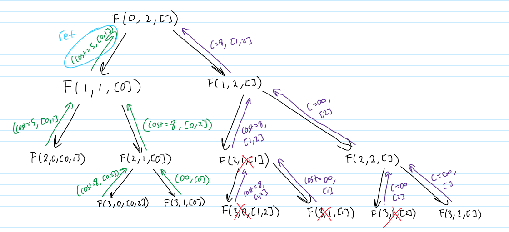
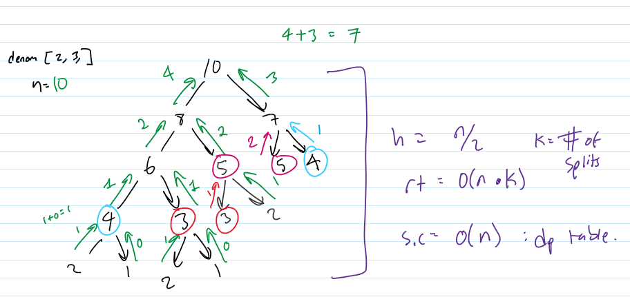
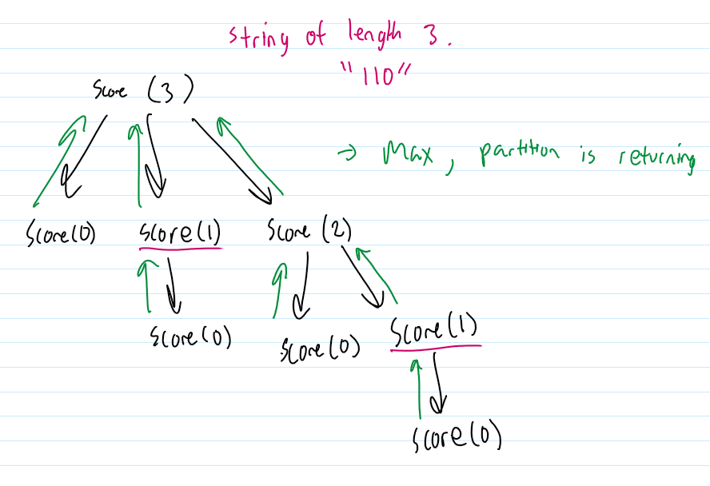

### CS334 HW1

### Henry Nguyen HN214

# Problem 1

    I affirm that I have not given or received any unauthorized help on this assignment and that this work is my own.

# Problem 2

intuition:

- We are given n points x1 ... xn, arranged in a cycle. The distance between them is the length of the shortest arc length between them.
- We are given the number of clusters K, in which we are to assign up to K clusters from the given points x1 ... xn
- Goal is to minimize the total sum of the minimal distances using cluster.
- At each step, we either use or do not use a point as cluster. A total of n choose k total combinations.
- Using the index and number of clusters, we are able to find all of the difference combinations of clusters.
- From these possible combinations, we compute the minimal cost and track the selected clusters.



## Recursive DP Algorithm:

- We keep track of the index
- Find all the possible combinations of K clusters
- From those possible combinations get the minimal cost and and selected cluster
- If the (index, k) is in the dp, return it else adds it to the dp

```py

#Assume distance is a 2d array, mapping of distances from xi to xn

#The compute_cost function iterates through all points, finds the shortest distance from each point to its nearest cluster, and sums up these minimum distances.
# return the total sum of the minimal distances between point i and cluster j
def compute_cost(n, selected_cluster, distance):
    total = 0
        for (i in range n)
        mincost = 0
            for (j in range len(slected_cluster)):
                mincost = min(mincost, distance[i][j])
                total += mincost
    return total

def find_k_clusters(index, k, selected_cluster, distance, dp):
    if k == 0:
        #we are retuning a copy of the current selection top revent any errors from backtracking
        return compute_cost(n, selected_cluster, distance), selected_cluster.copy

    if index >= n:
        #The index exceeds the number of nodes and there are clusters remaining
        return (inf, [])

    if index, k in dp:
        return dp[index, k]

    #Take
    selected_cluster.add(index)
    (cost_take, take) = find_k_clusters(index+1, k-1, selected_cluster, distance)
    selected_cluster.remove(index)

    #Not Take
    (cost_not, not_take) = find_k_clusters(index+1, k, selected_cluster, distance)


    #Return the minimal cost, along with the selected clusted associated with it
    If cost_take < cost_not:
        dp[index][k] = (cost_take, take)
    else:
        dp[index][k] = (cost_not, not_take)

    return dp[index][k]

```

## Time and space complexity analysis

With just recursion and no memoization:

Time Complexity: O(2^n \* n)

- Each point can either be chosen or not chosen; 2^n
- In the compute function there is a loop; n

Space Complexity: O(n)

- The maximum depth is n

With memoization:

- The dp can store: 0 to n vertices
- Out of the n vertices, we pick k clusters. DP[n][k]. Total = n \* k
- In the compute function there is a loop; n

Time complexity: n _ k _ n = O(n^2 \* k)

Space complexity: O(n \* k) // the dp table

## Proof By Induction

- We want to prove that our algorithm correctly computes the minimal cost for placing k clusters among the n points.

Base case k == 0:

- When k = 0, there are no clusters are placed. Every point is then assigned to the nearesst cluster and the total distance is computed.
- This is computed by the compute_cost function, taking in the selected_clusters as a parameter.
- The algorithm loops through each points and compares it with each of the cluster, summing up the minimal distance.
- This is guaranteed to give us the minimal value.

Inductive Hypothesis:

- Assume that for all cluster <= k and all index <= n, the algorithm correctly computes the minimal cost.

Inductive Step:

- Prove that the algorithm find_k_clusters(index, k+1) correctly computes the minimal cost

- In this algorithm, the recursive occurs when we are decide to "take" the current index as the cluster (k-1) or "not take" (same k). Based on the Inductive hypothesis, the algorithm will correctly compute all cluster <= k, and index <=n.

- Therefore by induction, the algorithm correctly computes the minimal cost.

# Problem 3

## Algorithm

```py

denom = [2,3,5,7,11,13,17,57]
dp = [-1] * (n+1)


def split(n, dp):
    if n == 0:
        return 1

    if n < 0:
        return 0

    if dp[n] != -1:
        return dp[n]

    count = 0

    for d in denom:
        count += split(n-d, dp)

    dp[n] = count

    return count

```



- Example Recursion Tree with n = 10, denominations of [2,3]

## Time and Space Complexity Analysis

- TC -> O(n \* k) //n is the depth, k is the number of splits or denominations
- SC -> O(n) //the size of the dp table

## Proof by induction

- prove that the algorithm correctly computes the total number of ways to split n using the given denominations.

### Base case n = 0

- The base case return 1 because the only way to make 0 is the empty set.

### Inductive Hypothesis:

- Assume thaat for all integers t <= n, the algorithm correctly computes the number of ways to form t using the given denominations.

### Inductive Step:

Prove the algorithm correctly computes for (t+1)

- The algorithm iterates over each denomnindation d and recursively calls split(t + 1 - d), reducing the problem to previously solved subproblems.
- Since each recursive call is for a value t' <= t, by I.H. the algorithm correctly computes split(t')
- Therefore, the total count from all recursive calls will correctly compute split(t + 1), as the sum of valid partitions.

By mathematical induction, the algorithm correctly computes split(n) for all n >= 0.

# Problem 4

## Intuition

- Find every possible contiguous subsets
  - We are partitioning the string into contiguous substrings
  - Each step, consider all possible substrings up to index i
- Evaluate each partition total score
- Top down approach (N to 0 or can do vice versa 0 to N)
- Loop through possible substrings



- Example recursion tree with i = 3, or 3 characters

## Algorithm

```py

def find_max(i, string, dp):
    if i == 0:
        return 0, []

    if dp[i] != -1:
        return dp[i]

    max_score = -inf
    max_part = []

    for j in range(i):
        sub = string[j:i]

        score = score_me(sub)

        prev_score, prev_partition = find_max(j, string)

        total_score = prev_score + score

        if(total_score > max_score):
            max_score = total_score
            max_part = prev_partition + sub

    dp[i] = max_score, maxpart

    return dp[i]


def score_me(substring):
    #Assume this function correctly return the score of the substring.
```

## Time and Space Complexity Analysis

- TIme Complexity: O(n^2) // length of string n, loops n time
- Space Complexity: O(n) // length of the string / size of dp

## Proof By Induction

- We want to proof that the algorithm will compute and find the set of substring s1..sn, such that the sum of the score is the maximum.

### Base Case: i == 0

- At i == 0 or 0 characters, the algorithm returns (0, [])
- Since there is no substrings, the maximum score is 0.

### Inductive Hypothesis:

- Assume that for any string of length t <= n the algorithm correctly computes the max score and optimal partition.

### Inductive Step:

- We want to prove algorithm correctly computes the max score partition for string of length t + 1.
- Recursive step:
  - The algorithm loops over all possible previous partition and tries every last substring String[j: t+1] for 0<=j<=t
  - Then it chooses the partition that maximizes the score.
- By I.H. the function correctly computes the find_max(j) for all j <= t.
- Therefore for all string of length n >= 0, the algorithm will correctly compute

# Problem 5

- I read the problem wrong and thought it was just asking to return the maximize, ran out of time to change it. We can just add an additional array to keep track of the visited satellites and a copy of the array on top of the max during each iteration, similiar to question 2.

## Intuition

- Search all the possible satellites at each given timeslot
- From all possible combinations we find the maximum signal
- We can either take or not take, aka stay on the same satellite or move to a different satellite
- If stay it will be O(1)
- If we move, we have to loop through s-1 satellites

## Algorithm

```py

    def findMax(time, curent_sat, delay, signals, satellites, dp):

        if time < 1:
            return 0

        if(dp[current_sat][time] != -1):
            return dp[current_sat][time]

        keep = f(time-1, curent_sat, delay, signals, satellites, dp) + compute_signal(current_satellite, time)


        max_switch = 0
        for(i in range(satellites)):
            if(satellites[i] != current_sat and (time - delay - 1 >= 1)):
                switch = func(time - delay - 1, satellites[i], delay, signals, satellites, dp) + compute_signal(sattelites[i], time)
                max_switch = max(max_switch, switch)

        dp[current_sat][time] = max(keep, max_switch)

        return dp[current_sat][time]

    def compute_signal(satellite, time):
        #Assume this function correctly computes the signal given the satellite and time.
        #Assume this function takes O(1)

```

## Time and Space Complexity Analysis

- Time Complexity: O(t x s^2)
  t possible time steps, s possible satellites. total unique states t x s
  Loop for s-1 possible states

- Space Complexity: O(t x s) //DP table

## Proof by induction

- We want to prove that the algorithm will return the maximum signal given the satellites and time

### Base case t < 1

- At time 0 meaning that we havent begun yet, the signal is just 0.

### Inductive Hypothesis

- Assume that for for all time t <= n, the algorithm correctly computes the maximum signal.

### Inductive Step

- Prove the algorithm return the maximum signal for t + 1

- During each recursion call, we can either keep or not keep, both resulting in the reduction of 1. The inductive hypothessis sastates that for all time t <= n, the algorithm correctly c omputes the maximum signal. This means that in each iteration the time is getting smaller and will be correctly computed.

-Therefore, for all time n >= 0, the algorithm correctly computes the maximum signal.

# Problem 6

# Intuition
