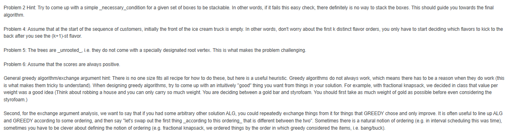

### Hint



## Problem 5

### A.

- Problem: Give an O(n) time algorithm for constructing the rest of the pairing
- Given: Some vertex r1 from T1 could be paired to vertex r2 from T2

- Approach: BFS

  - Implementation with queue
  - Base Case: If the r1 and r2 color does not match, return false

- Algorithm:

```py
def aglo(T1, T2, r1, r2):
    stack_t1 = []
    stack_t2 = []

    queue = [r1, r2]

    while(queue):
        node_r1, node_r2 = queue.pop(0)

        #Base Case; the color don't match
        if node_r1 != node_r2:
            return False

        neighbors_r1 = nei(node_r1) #Assume the function nei return a list of all the neighbors of node_r1
        neighbors_r2 = nei(node_r2)

        #This nested loop will iterate through all the nodes of r1 and compares it with r2, if it does not found a match, return a False becasue the tree is not the same.

        for i in neighbors_r1:
            found = False
            for j in neighbors_r2:
                if i == j:
                    queue.append((i,j)) #Adds the item to the queue
                    found = True
                    break

            if found == False:
                return False

    return True
```

#### Time Analysis: O(n^3)

- nei(): O(n)
- nested loop : O(n^2)
- while loop : O(n)

#### Proof of Correctness [TODO]

### B.

- Problem Statement: Find two vertics that are far apart as possible.

- Approach DFS

```pseudo

    #The usual DFS
    def dfs(node, diameter):
        if node is null: return 0

        left = dfs(node.left)
        right = dfs(node.right)

        diameter = max(diameter, left+right) # At this step can store the nodes if it is greater than the diameter
        return max(left,right) + 1

    def algo(root);
        diameter = 0
        return dfs(root, diameter)
```

#### Time Complexity Analysis: O(n)

- DFS: O(n) //the height of the tree, at the worst case the height would be n

#### Proof of correctness

### C.

## Problem 6

### A. Give an algorithm assuming that G is strongly connected

- **Strongly Connected Graph**: A Graph that is connected such that starting at each vertex you can get to another node. There must be a cycle.

- Approach: USE DFS or BFS traversal
- Since all nodes are reachable by definition, we just do a simple DFS or BFS to count all the nodes, while keeping track of the visited nodes

- Time O(m + n); We are at most visiting each node once and each edge once.

```py

def dfs(graph, node, visited):
    if node in visited:
        return 0  #already visited

    visited.add(node)
    score = graph[node]['score']

    for neighbor in graph[node]['neighbors']:
        score += dfs(graph, neighbor, visited)

    return score

```

### B. Give an algorithm assuming that G is a DAG

- **DAG (Directed AAcyclic Graph)**: A directed graph with no cycles.

  - It can be weakly connected: Its connected(if ignoring the directions)
  - It can be disconnected (isolated components)

- Approach: since the graph is a DAG, we can use topological sorting
  - For every directed edge u -> v, vertex u comes before vertex v in the ordering.
- Store all edges in an **Adjacency list**, so we know which vertices are reachable from each vertex
- Have a DP table where dp[i] is the the best score you can collect by reaching vertex i
  - For each vertex u in topological order:
    - For each neighbor v of u:
      - dp[v] = max(dp[v], dp[u] + score[v])
- The answer would be the maximum value in the dp table.

```py

def max_score(G, score, start):
    n = len(score) #num of vertices
    adj = adj_list(G) #assume adj_list returns an adjacency list from graph G

    order = top_sort(G) # Get the vertices in topological order. Assume that the function top_sort, sorts the vertices in topological order

    dp = [0] * n #initialize dp of size n
    dp[start] = score[start]

    for u in order:
        for v in adj[u]: # For each neighbor of u
            dp[v] = max(dp[v], dp[u] + score[v])


    return max(dp)
```

- Time Complexity: O(V + E)
  - Building adj list: O(E)
  - Topological Sort: O(V + E)
  - DP: O(V + E)
  - max(dp) : O(V)

### C. General Digraphs

- **General Graph**: A graph with directed edges and can have any strucures, including cycles, disconnected parts, and complex connectivity.

- Approach use recursion + memoization, similiar to DAG approach.

```python
def dfs(node, visited):
    if(not node):
        return 0

    if(node in visited):
        return vistied[node]

    score = node.score

    for nei in node:
        curr_score = score + dfs(nei visited)
        score = max(score, curr_score)

    return score


```

1. Start off at one node
2. Use DFS and keep exploring node neighbors
3. Once there is no node left, return score of that path
4. Backtrack and explore the next possible path
