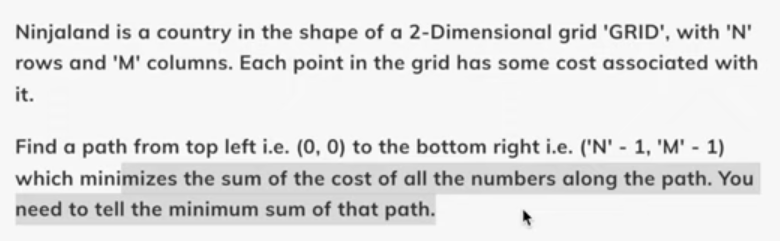

### Problem Statement

Step before DP

1. Try out all paths (Recursion)
   - Compare (i,j)
   - Explore all paths
   - Take the min path

### Extension of the previous problem, see dp_6 for reference
