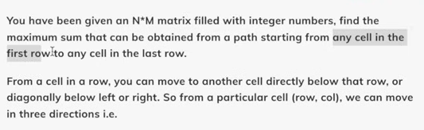

# DP 12. Minimum/Maximum Falling Path Sum | Variable Starting and Ending Points | DP on Grids

[reference](https://www.youtube.com/watch?v=N_aJ5qQbYA0&list=PLgUwDviBIf0qUlt5H_kiKYaNSqJ81PMMY&index=13)

### problem statement



### Approach 1: Try out all possible paths (Recursion)

1. Express (i,j) & Base Case
2. Explore all paths (left diag, down, right diag)
3. Max among all paths

Base Case
-Destination
-Out of bound

### Pseudocode

//Starting from the bottom and traversing to the top

```java
f(i, j) = the maximum path sum to reach (i,j) from any cell in the first row

f(i, j){
    if(j < 0 || j >= m ) return -INF;

    if(i==0) return a[0][j];

    int s = a[i][j] + f(i-1, j);
    int ld = a[i][j] + f(i-1, j-1);
    int rd = a[i][j] + f(i-1, j+1);

    return max(s, max(ld,rd))

}

```

- TC: 3^n
- SC: O(N)

-Add DP to optimize

- TC: O(NXM)
- SC: O(NXM) + O(N)

### Aproach 2: Tabulation (Bottom Up)

1. Base Case -- Storing the values of the base case into the dp
2. Observe (i,j) and convert to loops

```java

dp[i][j]


for(j -> m-1) d[0][j] = a[0][j];


for(i = 1 -> n-1){
    for(j = 0 -> m-1){
        u = a[i][j] + dp[i-1][j];
        if(j-1 >= 0)ld = a[i][j] + dp[i-1][j-1];
        if(j+1 <= m)rd = a[i][j] + dp[i-1][j+1];

        dp[i][j] = max(u,ld,rd);

    }
}


maxi = dp[n-1][0];

for(j=1 -> m-1){
    maxi = max(maxi, dp[n-1][j]);
}

```

- TC: O(N X M) + O(N)
- SC: O(N X M)

### Space Optimization

-Notice that you only need the previous "row" to compute the current dp[i][j] value
-Therefore we only need to store the previous row

```java

prev[m]


for(j -> m-1) prev[j] = arr[0][j];


for(i = 1 -> n-1){
    temp = []

    for(j = 0 -> m-1){
        u = a[i][j] + prev[j];
        if(j-1 >= 0)ld = a[i][j] + prev[j-1];
        if(j+1 <= m)rd = a[i][j] + prev[j+1];

        temp[j] = max(u,ld,rd);
    }

    prev = temp;
}


maxi = dp[n-1][0];

for(j=1 -> m-1){
    maxi = max(maxi, dp[n-1][j]);
}

```

- SC : O(M)
