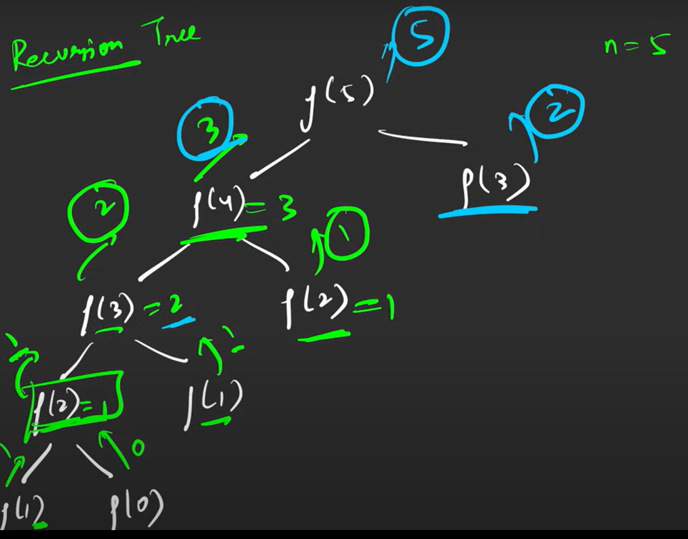
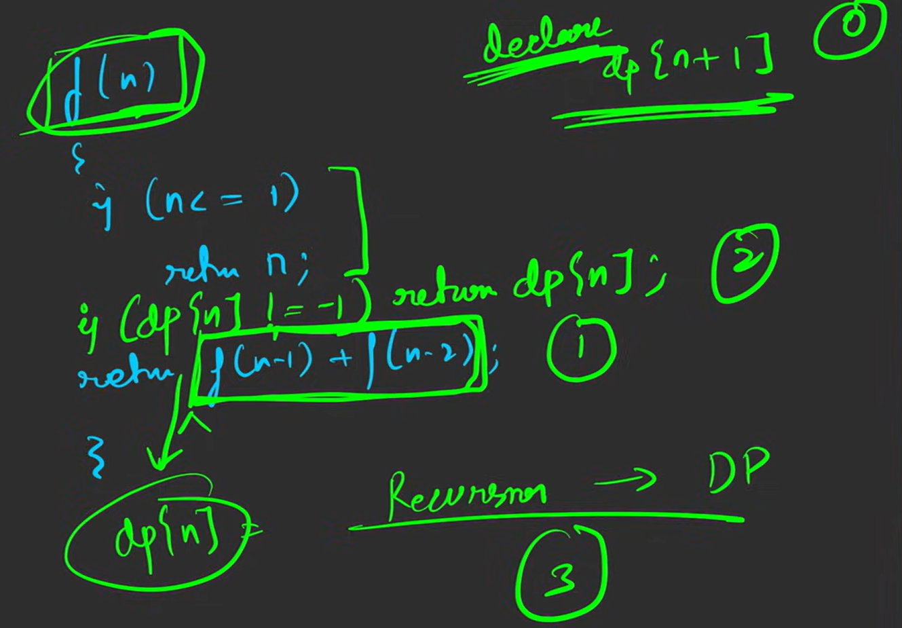

# DP: Fibonacci 

Resource: https://youtu.be/tyB0ztf0DNY?si=uwUmPckipYPIKu6w

1. Tabulation (Bottom Up)
2. Memoization (Top Down)
    -Store the value of sub-problem in some map

### Top Down Approach

Example 1: Fibonacci No

    0 1 1 2 3 5 8 ...
    0 1 2 3 4 5 6 

f(n) = f(n-1) + f(n-2)

f(4) = 3

### Time & Space Complexity

TC : O(N)
SC : O(N) [Stack Space] + O(N) [Array]  -> O(N)

### Bottom Up Approach

1. Base Case:
    dp[0] = 0
    dp[1] = 1

2. Look at Reccurence and try to translate into tabulation
    for (i = 2; i <= n ; i++) {
        dp[i] = dp[i-1] + dp[i-2];
    }

### Time & Space Complexity:

TC: O(N)
SC : O(N)

--Can convert into SC: O(1)

    prev2 = 0
    prev = 1

    for(int i = 2; i <= n; i++){

        curr = prev + prev2

        prev2 = prev
        prev = curr

    }
    return prev

--To Get even better TC, we can use **matrix exponentiation** to get O(log N).
