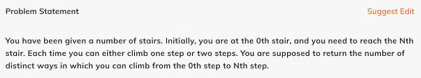
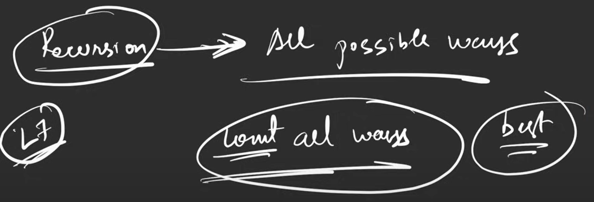

# DP 2. Climbing Stairs

Recursion:
-Count the # of ways | Max or Min
-try all possible ways

Shortcut:
1. Try to represent the problem in terms of index
2. Do all possible stuffs on that index, according to the problem statement
3. Sum up all stuffs -> count all ways
   Min(all stuffs) -> find min

    f(i){
        if (i  == 0 ) return 1
        if (i == 1) return 1

        left = f(index-1) //jump 1
        right = f(index-2) //jump 2

        return left + right
    }

Its a fibonaci, see dp1 for more information for optimization

