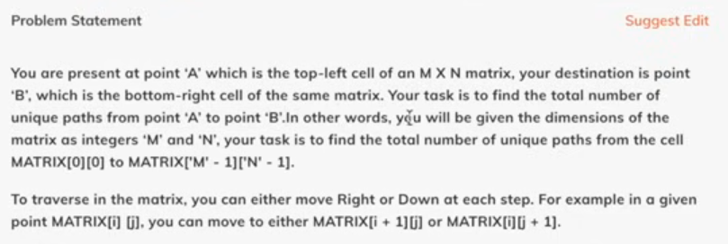
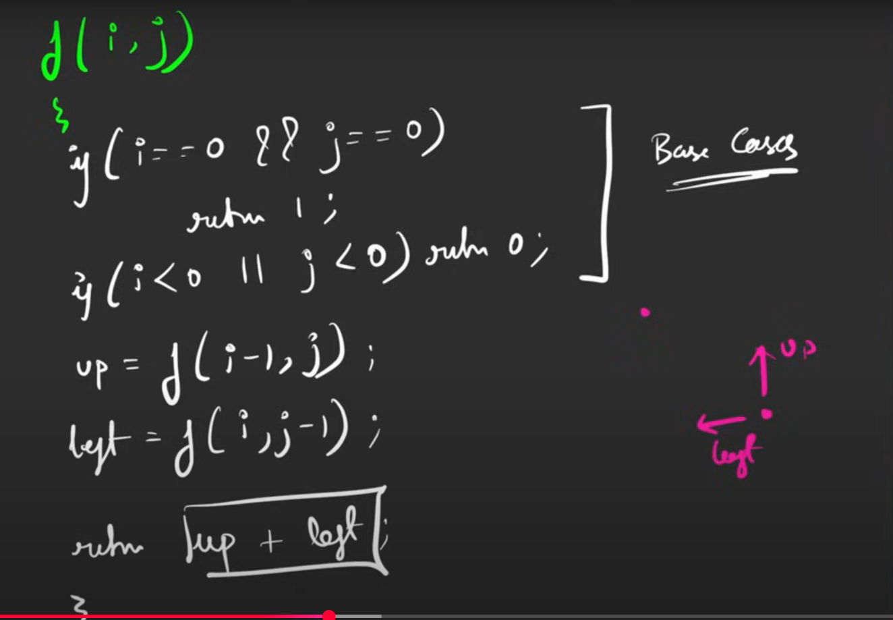
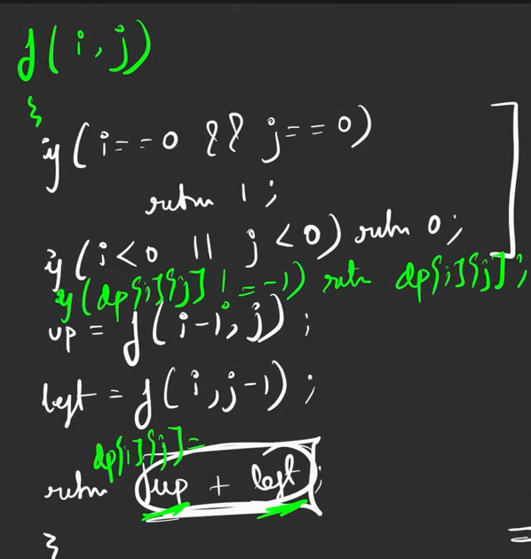
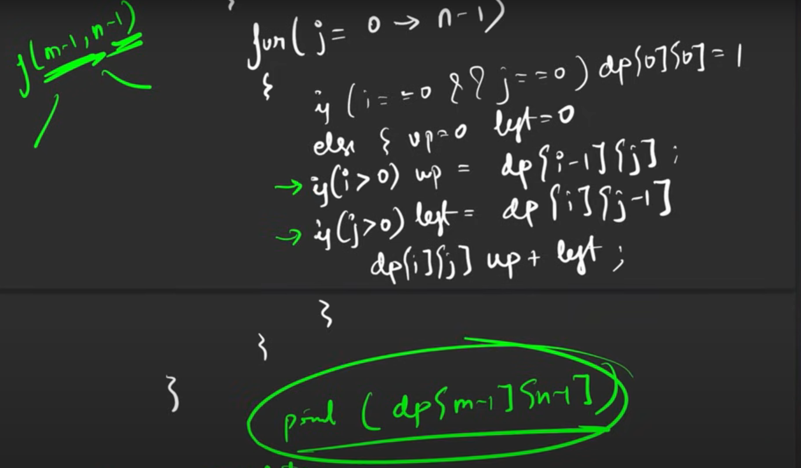

Problem Statement

Pseudocode

TC : 2^(m\*n)
SC : (m-1) + (n-1)

Recursion -> DP
-Memoization
-Apply when overlapping subproblems

With memo implementation

TC : O(m*n)
SC : O((n-1) + (m-1)) + O(n*m)

---

Tabulation

TC : O(n _ m)
SC : O(n _ m)

--

Space Optimization

- If there is a previous row & previous column, we can space optimize

Space optimize; 1D
