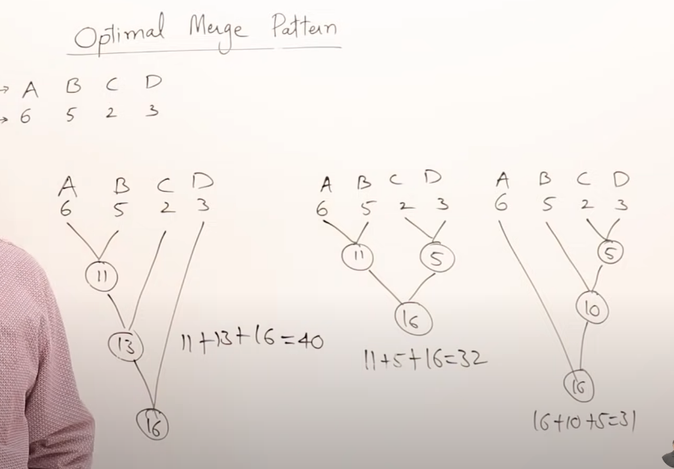

# Intro to Greedy Method

[reference](https://youtu.be/ARvQcqJ_-NY?si=m_6_9-3mecrI_NDt)

#### Series by Abdul Bari

- Solving Optimizing Problems

  - Min / Max

- **Feasible Solution** : Satisifies the constraint

- **Optimal Solution** : Solution is feasible and return the _Best_ result. Can only be 1 op sol

## Strategies for solving Optimizing Problems

1. Greedy Method
2. Dynamic Programming
3. Branch and Bound

```python
    Algorithm Greedy(a, n):
        for i to n:
            x = select(a)
            if x is feasible then
                solution = solution + x
```

## Optimal Merge Pattern

Goal: Total cost of merge is minimize
--Used for huffman
[Reference](https://www.youtube.com/watch?v=HHIc5JZyenI)


