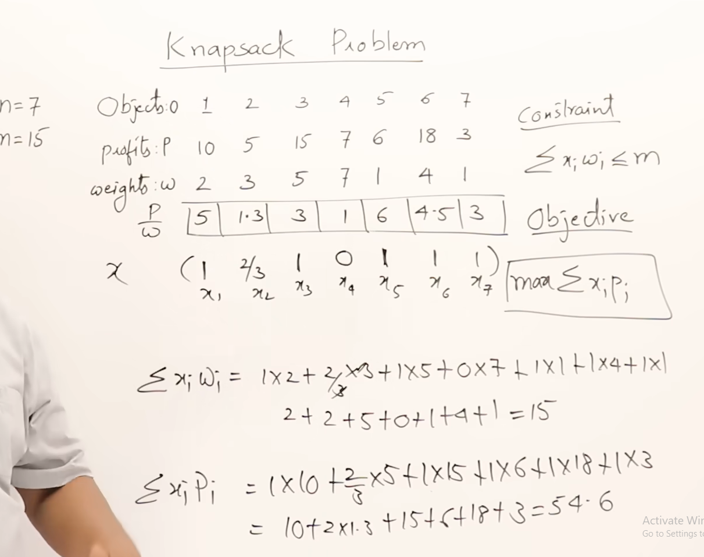

# Knapsack Problem

[reference](https://www.youtube.com/watch?v=oTTzNMHM05I&t=14s)

n = 7 // seven object
m = 15 // bag capacity

Solution: Select highest profit / weights

--Greedy because we can take fractional items

