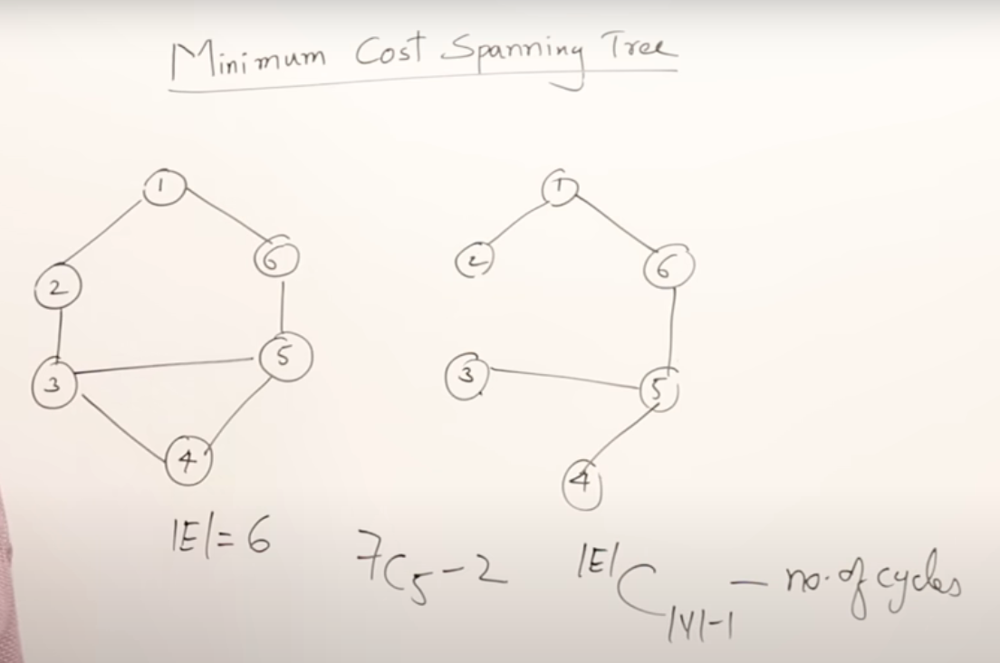
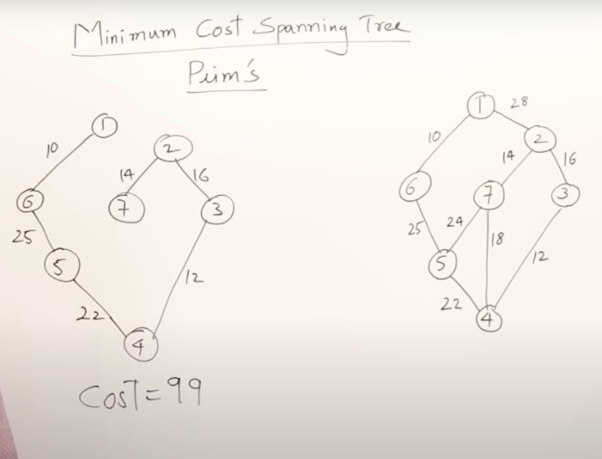
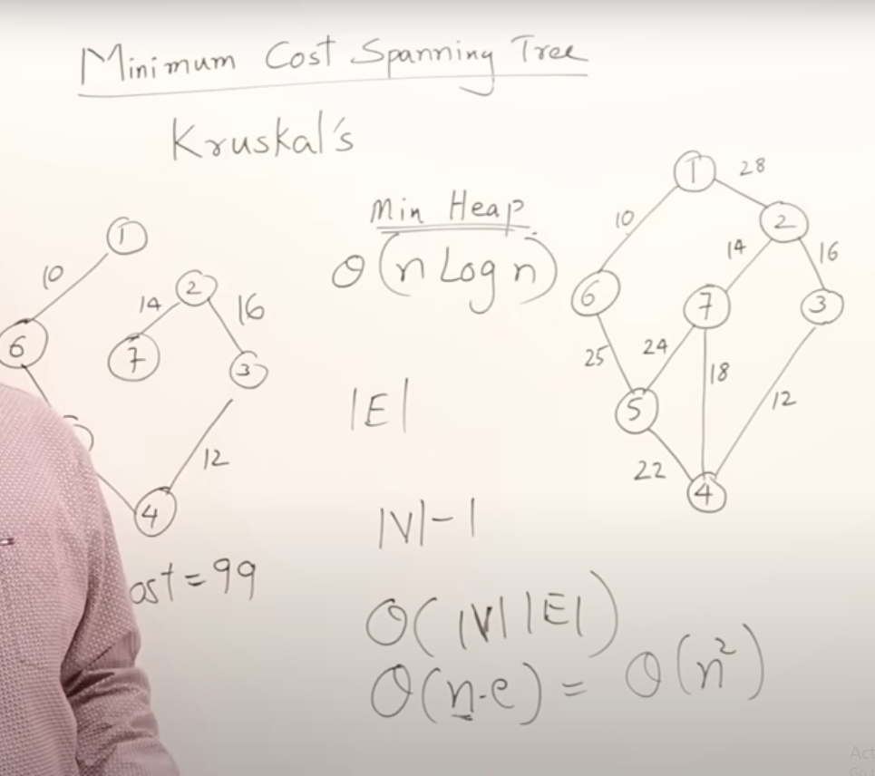
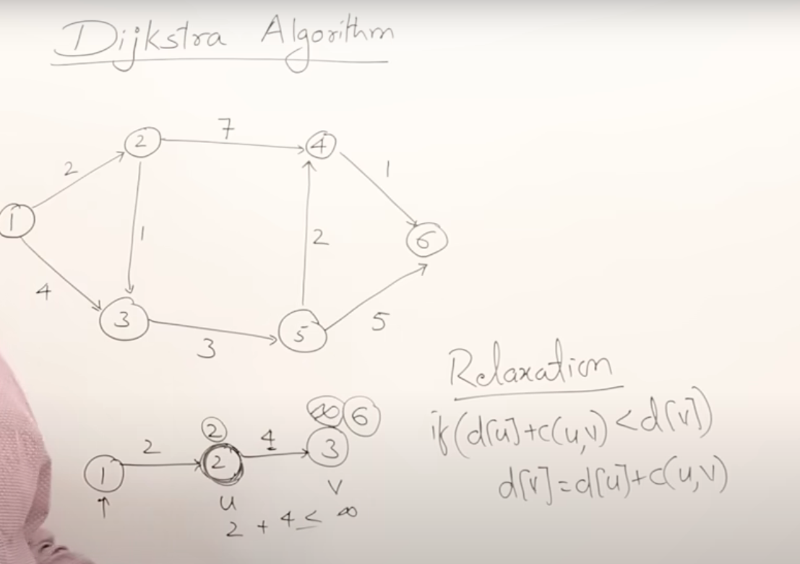

[reference](https://www.youtube.com/watch?v=4ZlRH0eK-qQ&t=8s)

Spanning Tree?

- Subgraph of a graph
- Have all vertices and v-1 edges
- No cycle

Finding Minimum Cost Spanning Tree

1. Prim's
   

- Select the minimum edge from the connected graph
- Graph must be connected

2. Kruskal's

- Select the minimum edge, do not select if it forms a cycle
- May work for non connected graph
  

---

# Dijkstra Algo

