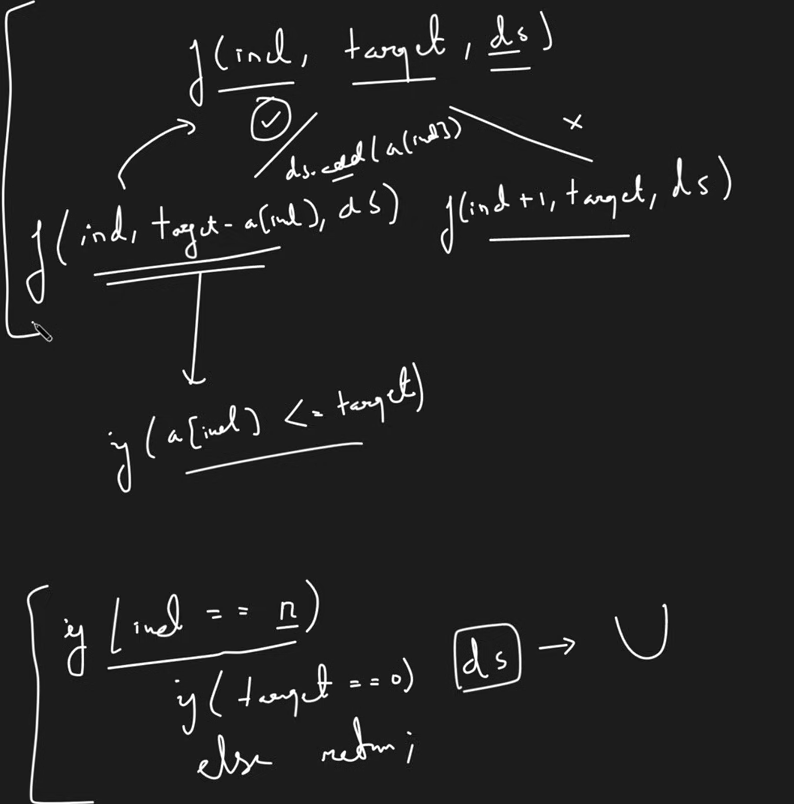
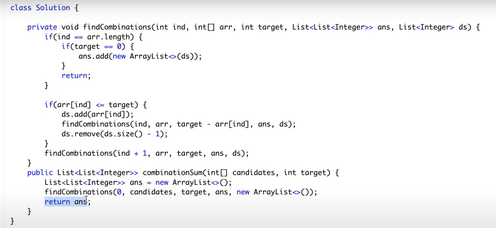

# Combination Sum

[reference](https://www.youtube.com/watch?v=OyZFFqQtu98&list=PLgUwDviBIf0rGlzIn_7rsaR2FQ5e6ZOL9&index=10)

## Problem Description

Given an array of integers, and a target k, return all possible combinations that adds up to k.

## Intuition

-Pick
-Not Pick

## Time and Space Complexity Analysis

- TC: 2^t x k
- SC: k x n

## Java Code

