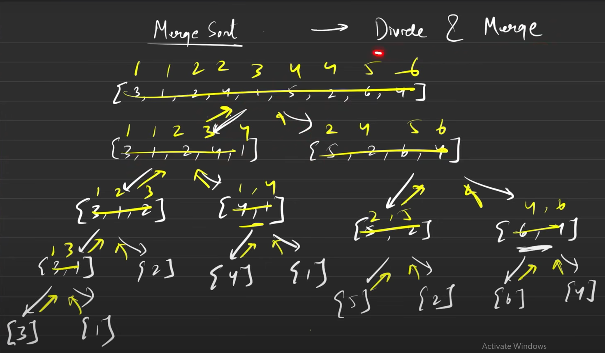
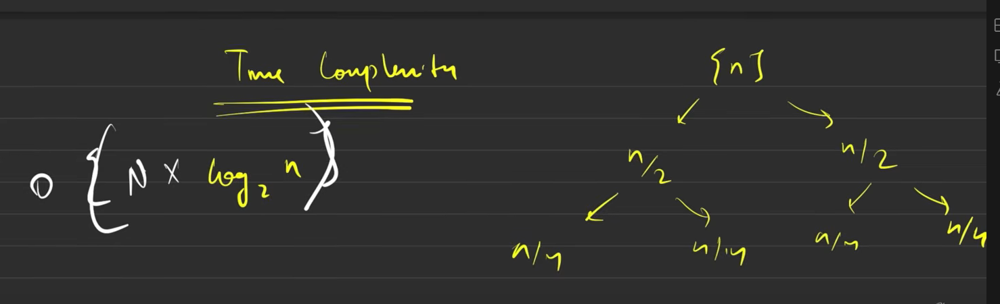
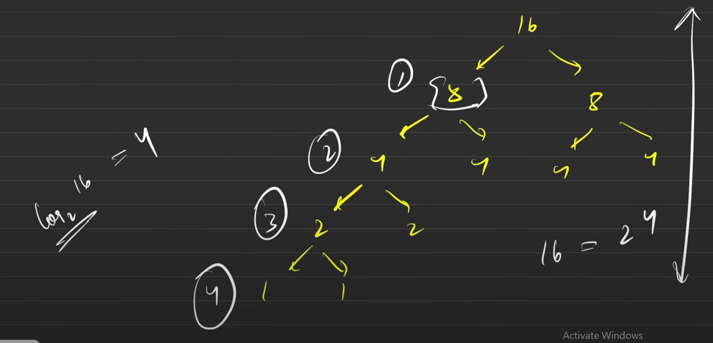

# Merge Sort : Divide & Merge

Credits: take U forward YT



### Merge Sort Algorithm - Pseudocode

```plaintext
mergeSort(arr, low, high)
{
    if (low >= high) {
        return
    }

    mid = (low + high) / 2

    left = mergeSort(arr[low:mid+1], 0, mid - low)
    right = mergeSort(arr[mid+1:high+1], 0, high - mid - 1)

    return merge(left, right)
}

merge(left, right)
{
    newArr = array of size (left.length + right.length)
    l, r, i = 0, 0, 0

    while (l < left.length AND r < right.length) {
        if (left[l] <= right[r]) {
            newArr[i] = left[l]
            l++
        } else {
            newArr[i] = right[r]
            r++
        }
        i++
    }

    // Copy any remaining elements from left subarray
    while (l < left.length) {
        newArr[i] = left[l]
        l++
        i++
    }

    // Copy any remaining elements from right subarray
    while (r < right.length) {
        newArr[i] = right[r]
        r++
        i++
    }

    return newArr
}

```

### Time & space complexity analysis

Space Complex: O(N X log_2(n))




Space Complex: O(N)

    - We are allocating an array of O(N) when merging.
