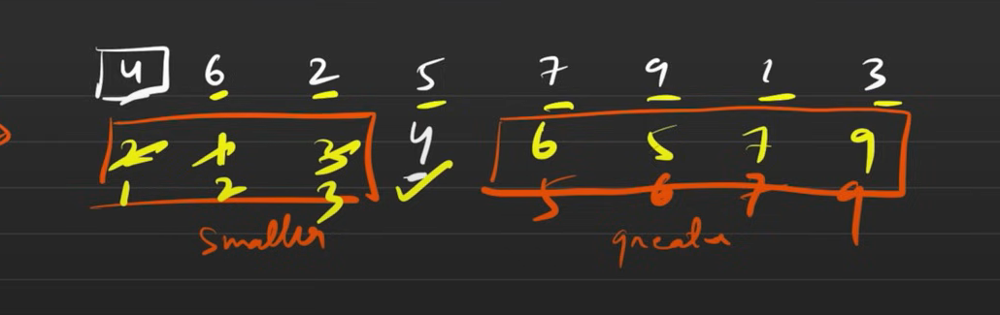

# Quick Sort Algorithm

## Overview

Quick Sort is a divide-and-conquer sorting algorithm that works by selecting a **pivot** element and partitioning the array into two halves:

- Elements **smaller** than the pivot go to the left.
- Elements **larger** than the pivot go to the right.
- The process is recursively applied to both halves.

## Steps

1. **Choose a Pivot** – Typically, the first or last element is chosen.
2. **Partition the Array** – Rearrange elements such that smaller elements are on the left and larger ones on the right.
3. **Recursively Sort Subarrays** – Apply the same logic to the left and right partitions.



## Pseudocode

```plaintext
function quickSort(arr, low, high) {
    if (low < high) {
        partitionIndex = partition(arr, low, high);
        quickSort(arr, low, partitionIndex - 1);
        quickSort(arr, partitionIndex + 1, high);
    }
}

function partition(arr, low, high) {
    pivot = arr[low];
    i = low;
    j = high;

    while (i < j) {
        while (arr[i] <= pivot && i < high) {
            i++;
        }
        while (arr[j] > pivot && j > low) {
            j--;
        }
        if (i < j) {
            swap(arr[i], arr[j]);
        }
    }

    swap(arr[low], arr[j]); // Place pivot in its correct position
    return j; // Return the pivot index
}
```

## Time and Space Complexity Analysis

- TC : O(N LOG N)
- SC : O(1)
