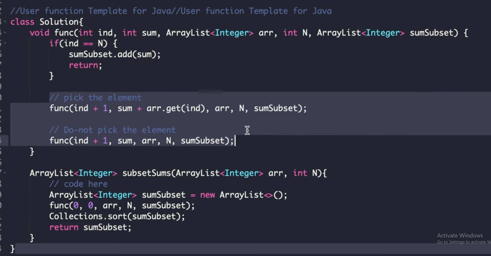
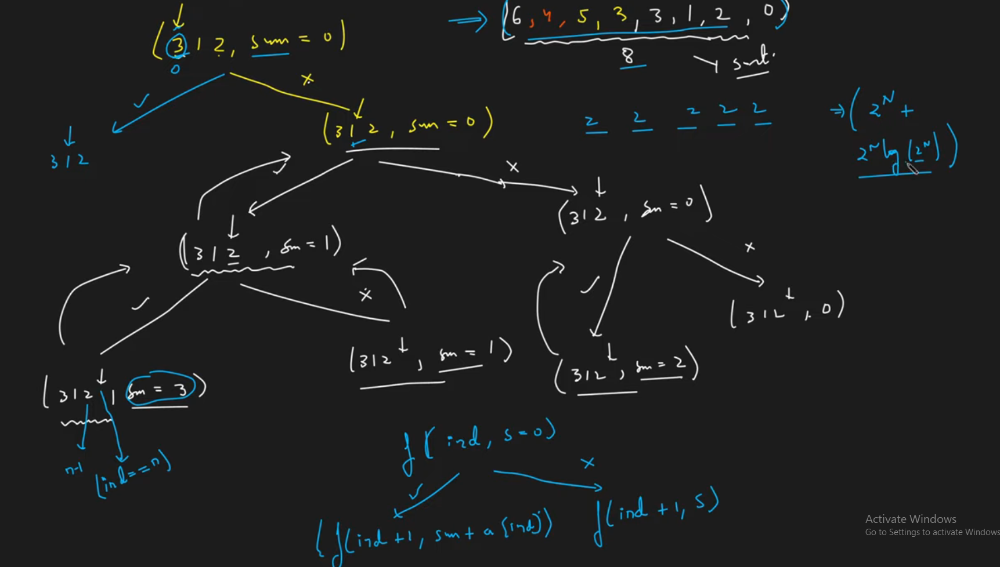

# Subset Sum 1

[reference](https://www.youtube.com/watch?v=rYkfBRtMJr8&list=PLgUwDviBIf0rGlzIn_7rsaR2FQ5e6ZOL9&index=13)

Problem Description

- Given a list of N integers, print sums of all subsets in it. Output should be printed in increasing order of sums

## Brute Force Approach

- Take or Not Take

