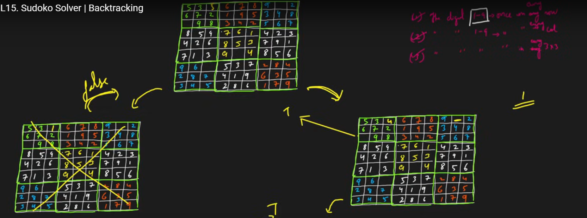
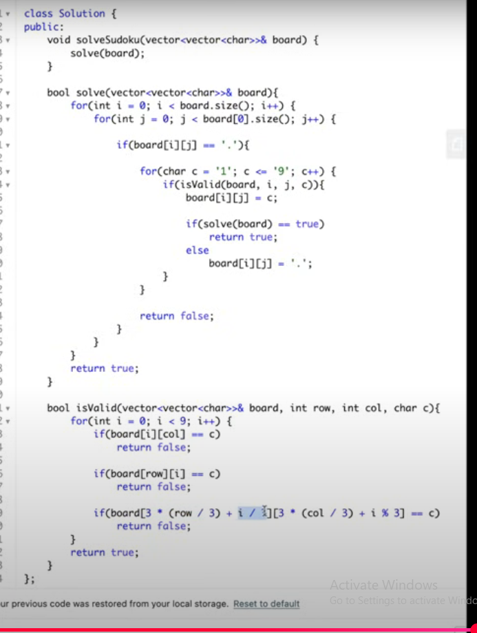

# Sudoku Solver

[reference](https://www.youtube.com/watch?v=FWAIf_EVUKE&list=PLgUwDviBIf0rGlzIn_7rsaR2FQ5e6ZOL9&index=17)

### Problem

- Solving a sudoku puzzle that is incomplete

1. Digit 1-9 appear once in any row
2. Digit 1-9 appear once in any col
3. Digit 1-9 appear once in any 3x3

